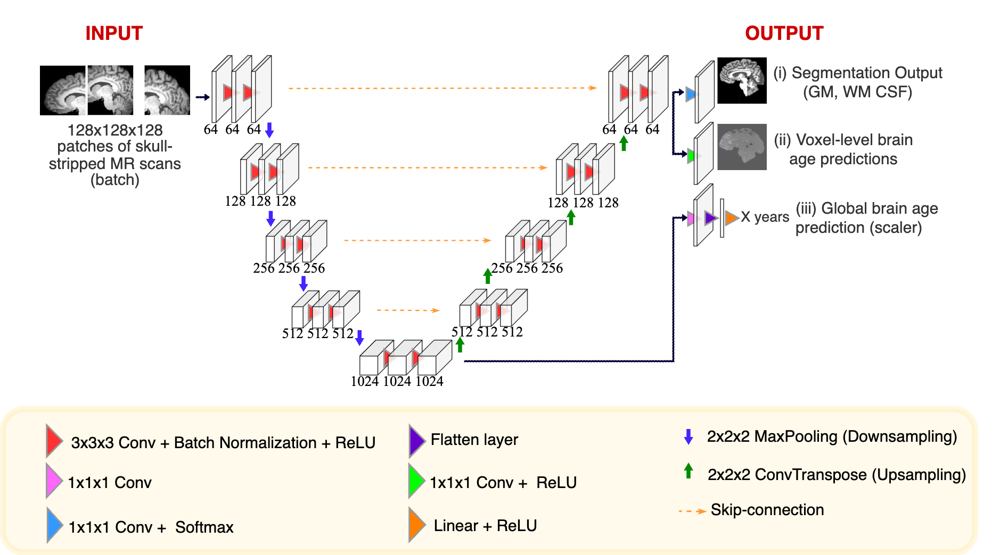

# A Multitask Deep Learning Model for Voxel-level Brain Age Estimation
### Model Architecture

This is the official repository for the paper titled 'A Multitask Deep Learning Model for Voxel-level Brain Age Estimation'.  
Status: Accepted at MLMI workshop @ MICCAI 2023.

_**It is highly recommended to go through all code and replace any placeholders (XXXX) with appropriate paths.**_


#### Source code structure:
* Main repo contains the files for training
* Testing folder contains the testing source code with a csv for CC359 testing subjects, the data-loader in the testing directory can be used to obtain the CamCAN testing subjects using shuff_files_camcan.csv.
* Ablation experiment models use the same data-loader as training, the model architecture files are present in the ablation experiment directory.

#### To download the data
* CAMCAN - [data access link](https://camcan-archive.mrc-cbu.cam.ac.uk/dataaccess/)
* CC359 - [data access link](https://docs.google.com/forms/d/e/1FAIpQLSe5hfUkyZQAFGP2yFKxEjv8h0KbIXyAKIHffwXCuQJ5Y7SqRw/viewform)


#### Step 1: To train the model
```
python main.py --learning_rate 0.001 --batch_size 3 --epochs 300 --root_dir #add root directory#
```
***

#### Step 2: To test the model

```
python main_test.py --root_dir #add root directory# --checkpoint_path #add path to saved model .pth file#

```

* The full paths in shuff_files_camcan.csv and cc359_test.csv have been anonymized with XXXX excluding the name of input data files, make appropriate changes as per the location of files on your system.
* Paths for saving intermediary files like saved model, text file with results, images etc have been anonymized with XXXX for anonymity in various places across the code. Include the appropriate paths before running.
* Update the batch size as per the available computational resources.
